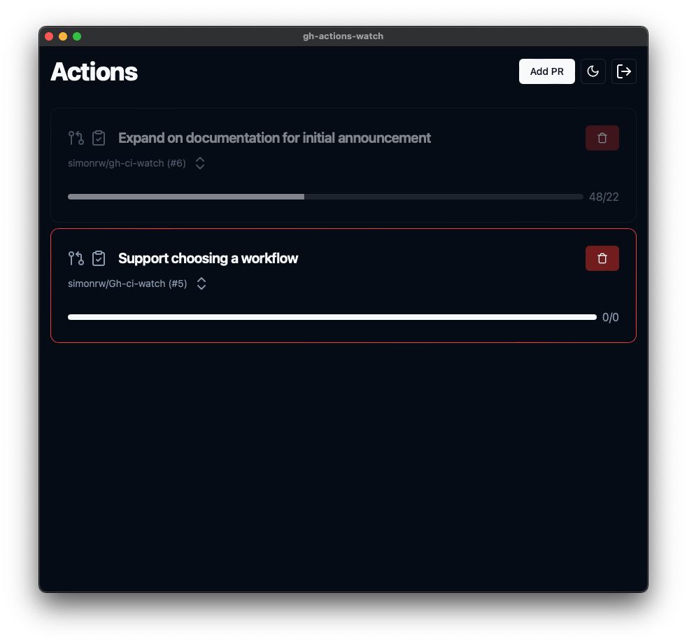

# GitHub Actions Monitor

_Track your CI runs on PRs in a handy and beautiful desktop app._

I often have multiple PRs running CI in progress, and wish to have a better handle on CI completion. I used to use the GitHub CLI with a command similar to:

```fish
gh pr checks --watch; and <send desktop notification>
```
however I often lost track of which notification belonged to which branch. I wanted to build a desktop application that was good to look at.


## Features



* Live updating of PRs in progress
* System notifications on completion
* Links to the PR and checks
* Inline description of the PR for context
* Dark and light modes

## Installation

Visit the [project releases](https://github.com/simonrw/gh-ci-watch/releases) and download the latest application for your architecture.


## Usage

On startup, the application will ask for your GitHub token. You can use `gh auth token` if you have installed the GitHub CLI, or you can go to [your tokens settings page](https://github.com/settings/tokens?type=beta) and add a token. Then paste your token in the initial screen of the app.

### Required token scopes

When creating a token, we recommend using "Fine-grained tokens", as this minimises the permissions granted.

This project requires _read-only_ access to the following scopes:

* `actions` for:
    * `/repos/{owner}/{repo}/actions/workflows`
    * `/repos/{owner}/{repo}/actions/workflows/{workflow_number}/runs`
    * `/repos/{owner}/{repo}/actions/runs/{run_number}/jobs`
* `contents` for:
    * `/repos/{owner}/{repo}/pulls/{pr_number}`

for any repository you wish to track.

## Config file

This application can be configured by creating a `gh-actions-monitor/config.toml` file in your systems configuration dir. This file should be placed in your `XDG_CONFIG_HOME` directory. See the [table in the documentation to the `dirs::config_dir` function](https://docs.rs/dirs/latest/dirs/fn.config_dir.html) to locate your `XDG_CONFIG_HOME` directory.

For example, on Linux this configuration file will be located at `~/.config/gh-actions-monitor/config.toml`.

### Error reporting

This application reports errors with [Sentry](https://sentry.io/). If you do not wish to send error reports, you can disable this functionality by setting `enable_sentry = false` in your [config file](#config-file).

## Development

This project is written in Rust using the Tauri application framework.
The frontend is written in React using TypeScript, with [shadcn/ui](https://ui.shadcn.com/) and [tailwind](https://tailwindcss.com/) for styling.

### Requirements

* `rust`
* `pnpm`

### Getting set up

1. `pnpm install` in the top level dir
2. `pnpm start` to start the application in "development" mode, where the UI will hot reload, and changes to the Rust code will cause a recompilation and restart of the app.
